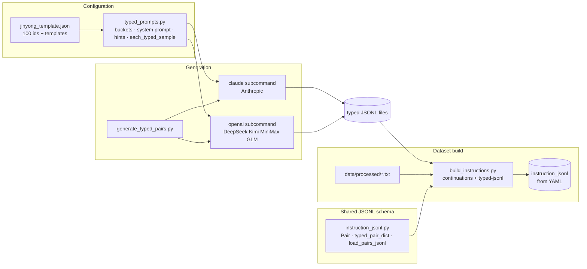
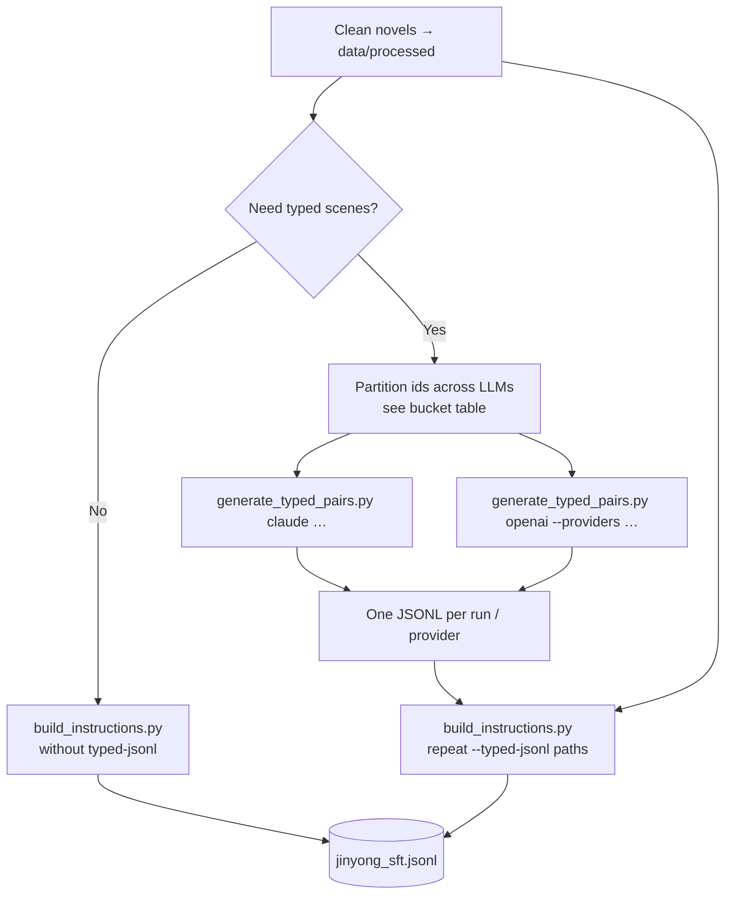

# Typed pairs pipeline

Single source of truth for **typed scene instructions**: [`configs/jinyong_template.json`](../configs/jinyong_template.json) — an array of `{ "id", "type", "template" }`. The **`template`** field is sent **verbatim** as the JSONL **`instruction`**; 【slots】 are interpreted by each LLM without a separate filler script.

## Architecture (how it fits together)



## Operator workflow



## Why disjoint buckets?

Previously every generator reused the same **20 prose prompts**, so multiple APIs produced overlapping instructions. Now **template ids are partitioned** so each backend owns a disjoint slice (**100 ids total**, **no overlap** across default buckets):

| Bucket    | Template ids | Typical command                                              |
|-----------|--------------|--------------------------------------------------------------|
| `claude`  | 1–20         | `python scripts/generate_typed_pairs.py claude …`            |
| `deepseek` | 21–40       | `… openai --providers deepseek …`                           |
| `kimi`    | 41–60        | `… openai --providers kimi …`                               |
| `minimax` | 61–80        | `… openai --providers minimax …`                            |
| `glm`     | 81–100       | `… openai --providers glm …`                                |

Shared library code:

- [`scripts/typed_prompts.py`](../scripts/typed_prompts.py) — **`SYSTEM_PROMPT_JINYONG_TYPED`**, **`VARIATION_HINTS`**, **`load_typed_scenes`**, **`scenes_for_bucket`**, **`scenes_for_provider_slug`**, **`typed_user_turn`**, **`each_typed_sample`**.
- [`scripts/instruction_jsonl.py`](../scripts/instruction_jsonl.py) — **`Pair`** / **`typed_pair_dict`** / **`load_pairs_jsonl`** — same schema as **`build_instructions.py`**.

## Commands

### 1) Claude (ids 1–20)

```bash
export ANTHROPIC_API_KEY=...
python scripts/generate_typed_pairs.py claude \
  --output data/instructions/typed_pairs.jsonl \
  --bucket claude \
  --templates-config configs/jinyong_template.json \
  --per-template 10
```

### 2) DeepSeek / Kimi / MiniMax / GLM (ids 21–100)

Configure `.env` keys (see script docstring / `.env.example`), then:

```bash
pip install openai python-dotenv
python scripts/generate_typed_pairs.py openai \
  --providers deepseek,kimi,minimax,glm \
  --output data/instructions/more_types_pairs.jsonl \
  --per-template 10
```

Each active provider only sees **its** id range.

### 3) Merge into training JSONL

[`scripts/build_instructions.py`](../scripts/build_instructions.py) accepts **multiple** `--typed-jsonl` paths (repeat flag or comma-separated):

```bash
python scripts/build_instructions.py \
  --typed-jsonl data/instructions/typed_pairs.jsonl \
  --typed-jsonl data/instructions/more_types_pairs.jsonl \
  --stats
```

Sliding-window **continuation** pairs always come from `data/processed/*.txt`; typed rows from all listed JSONLs are concatenated, validated, then merged into one dataset (respecting **`--seed`** / **`--max-pairs`** on the **combined** list).

## Relationship between scripts

| Script | Role |
|--------|------|
| `typed_prompts.py` | Template JSON loader, bucket map, system prompt, hints, **`typed_user_turn`**, **`each_typed_sample`** |
| `instruction_jsonl.py` | **`Pair`** schema + **`load_pairs_jsonl`** / **`typed_pair_dict`** (`build_instructions` reuses **`Pair`**) |
| `generate_typed_pairs.py` | CLI: **`claude`** \| **`openai`** subcommands → typed JSONL |
| `build_instructions.py` | Reads cleaned novels + **zero or more** typed JSONLs → final **`instruction_jsonl`** |

Using **different LLMs on disjoint templates** increases stylistic diversity while keeping one Jin Yong–oriented system prompt.

## Inference / evaluation

Do **not** import removed tuples from `build_instructions.py`. Load prompts from JSON via:

```python
from typed_prompts import load_typed_scenes
scenes = load_typed_scenes("configs/jinyong_template.json")
```

See [`notebooks/03_inference.ipynb`](../notebooks/03_inference.ipynb).

## Operational notes

- **Costs**: `--per-template` multiplies calls × number of ids in each bucket.
- **Quality**: Tune `--min-output-chars` in `build_instructions.py` if skeleton prompts yield shorter completions.
- **Mainland Hub**: Training/merge may need `HF_ENDPOINT`; see [`docs/autoDL.md`](autoDL.md).
